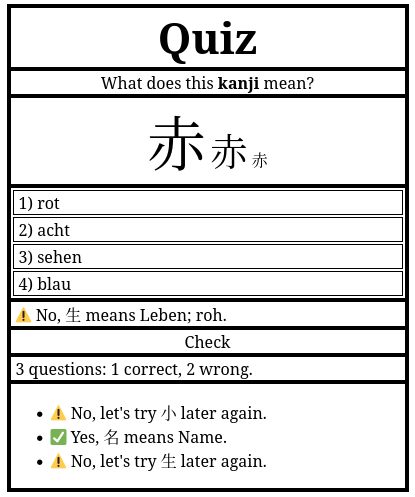

# Kanji Quiz
A small JS app for practicing Kanji reading.

Nothing fancy but small exercise in JavaScript.

Here's a screenshot:

Currently, only 80 kanjis are considered. They've been taken from the ["Erstes Schuljahr" section](https://de.wikipedia.org/wiki/Ky%C5%8Diku-Kanji#Erstes_Schuljahr_(80_Kanji)) in the German Wikipedia.